# YouTube Summarizer

A full-stack web application that automatically downloads, transcribes, and summarizes YouTube videos using various AI models.

## Architecture Overview

### Backend (Python/FastAPI)

The backend is built with FastAPI and provides a RESTful API with real-time streaming capabilities for video summarization.

#### Core Components

- **API Layer** ([`src/youtube_summarizer/api.py`](src/youtube_summarizer/api.py:1)): FastAPI application with SSE streaming endpoints
- **Download Engine** ([`src/youtube_summarizer/download.py`](src/youtube_summarizer/download.py:1)): Uses `yt-dlp` for video downloading
- **Transcription Service** ([`src/youtube_summarizer/scribe.py`](src/youtube_summarizer/scribe.py:1)): Uses `faster-whisper` for real-time audio transcription
- **Summarization Engine** ([`src/youtube_summarizer/summarize.py`](src/youtube_summarizer/summarize.py:1)): Uses `ollama` and `qwen3:4b` model by default for summarization
- **Job Management** ([`src/youtube_summarizer/jobs.py`](src/youtube_summarizer/jobs.py:1)): Uses async.io + asynchronous job queue to send clients real-time updates
- **Database** ([`src/youtube_summarizer/database.py`](src/youtube_summarizer/database.py:1)): TinyDB for video metadata and job tracking
- **Configuration** ([`src/youtube_summarizer/config.py`](src/youtube_summarizer/config.py:1)): Centralized configuration management

### Frontend (SvelteKit)

The frontend is a modern SvelteKit application with TypeScript and Tailwind CSS for a responsive user interface.

#### Key Features

- Real-time progress updates via Server-Sent Events (SSE)
- Clean, responsive UI with Tailwind CSS
- TypeScript for type safety
- Progressive Web App capabilitieFormatting disk12s2 as Mac OS Extended (Journaled) with name Gargantuas

### Processing Pipeline



1. **Download Phase**: Extract video metadata and download audio as MP3
2. **Transcription Phase**: Convert audio to text using Whisper model
3. **Summarization Phase**: Split text into chunks and summarize using LLM
4. **Output**: Generate structured markdown summary in `content/summaries/`

All phases communicate to the job manager which sends SSE's to the clients.

## API Endpoints

### Core Endpoints

- `POST /api/summarize` - Initiate video summarization
- `GET /api/summarize/{video_id}/subscribe` - Subscribe to real-time updates

### Job States

- `starting` - Job created and preparing
- `preparing` - Preparing download
- `downloading` - Downloading video
- `converting` - Converting to audio
- `transcribing` - Transcribing audio
- `summarizing` - Generating summary
- `summarized` - Process completed
- `error` - Process failed

## Real-time Updates

The application uses Server-Sent Events (SSE) to provide real-time updates to clients:

```typescript
// Example client-side subscription
const eventSource = new EventSource(`/api/summarize/${videoId}/subscribe`);
eventSource.onmessage = (event) => {
  const data = JSON.parse(event.data);
  // Handle real-time updates
};
```

## Dependencies

### Backend Dependencies

- **FastAPI**: Web framework for building APIs
- **yt-dlp**: YouTube downloader with progress hooks
- **faster-whisper**: High-performance speech recognition
- **ollama**: Local LLM inference
- **langchain**: Text processing and chunking
- **tinydb**: Lightweight document database
- **uvicorn**: ASGI server

### Frontend Dependencies

- **SvelteKit**: Frontend framework
- **TypeScript**: Type-safe JavaScript
- **Tailwind CSS**: Utility-first CSS framework
- **Vite**: Build tool and development server

## Setup Instructions

### Prerequisites

- Python 3.11+
- Node.js 18+
- Ollama installed with `qwen3:4b` model
- FFmpeg (for audio conversion)

### Backend Setup

```bash
# Install Python dependencies
poetry install

# Start the backend server
python -m youtube_summarizer
```

### Frontend Setup

```bash
# Install Node.js dependencies
cd frontend
npm install

# Start the development server
npm run dev
```

### Configuration

Edit [`src/youtube_summarizer/config.py`](src/youtube_summarizer/config.py:1) to customize:

- Whisper model settings
- Ollama model selection
- File storage paths
- Token limits

## Project Structure

```
├── src/youtube_summarizer/     # Backend Python package
│   ├── __main__.py            # Application entry point
│   ├── api.py                 # FastAPI application
│   ├── download.py            # Video download logic
│   ├── scribe.py              # Audio transcription
│   ├── summarize.py           # Text summarization
│   ├── jobs.py                # Job management system
│   ├── database.py            # Database operations
│   ├── config.py              # Configuration management
│   └── utils.py               # Utility functions
├── frontend/                   # SvelteKit frontend
├── content/                    # Generated content
│   ├── summaries/             # Markdown summaries
│   ├── transcriptions/        # Text transcriptions
│   └── downloads/             # Downloaded audio files
└── static/                    # Static assets
```

## Future Enhancements

- [ ] Add support for batch processing
- [ ] Implement user authentication
- [ ] Add video search and discovery
- [ ] Support for additional LLM models
- [ ] Database migration to PostgreSQL
- [ ] Add video chapter detection

## Contributing

1. Fork the repository
2. Create a feature branch
3. Make your changes
4. Add tests if applicable
5. Submit a pull request

## License

None yet lol

## Inspiration

Todo

## Development Process

Todo
